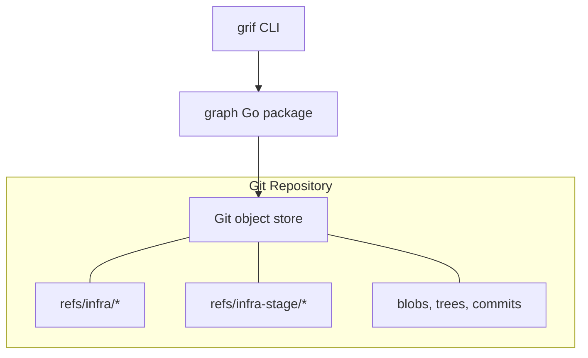
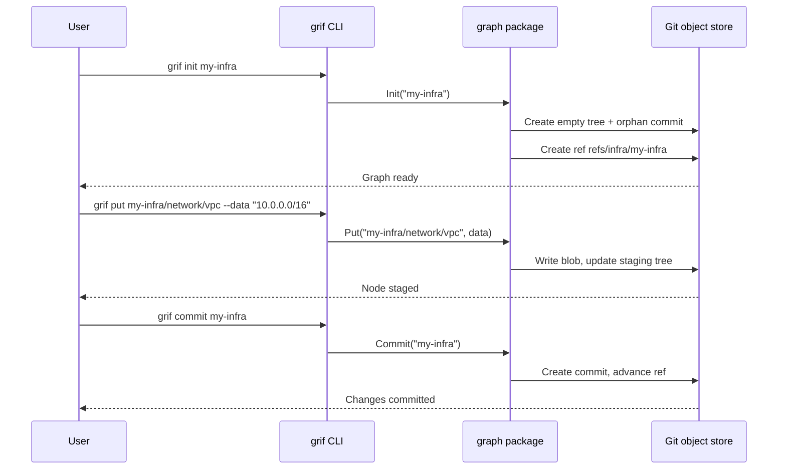

# Git Infrastructure Graph — Architecture Overview

## What It Is

Git Infrastructure Graph (`grif`) is a versioned graph database for infrastructure data that runs entirely inside a Git repository. It stores infrastructure entities and their relationships as native Git objects — no external database, no additional services, no new infrastructure to manage. A Golang module and a command-line tool are provided.

Any Git repository that holds Infrastructure as Code can also hold a `grif` graph alongside it, versioned in lockstep with the code it describes.

## The Problem

Infrastructure teams today lack a simple, version-controlled way to capture the *data* of their infrastructure — the resources, the hierarchy, and the relationships between them — in a way that travels with the code and is directly connected to the actual deployments. They currently capture application code and infrastructure as code (IaC), and some teams use GitOps to capture deployment state. But three things are missing:

- The data model of the deployed infrastructure. Some teams have a sprawl of parameter files. Some teams use GitOps tools capture data , also as parameter files. These files have no relationships to each other and are full of repetition without validation.
- A versioned history of how the infrastructure evolved over time, including the actual deployment results.
- A viewable abstraction of the relationships between resources. GitOps environments have some of this data, but it is in two dimensions (flat files), making it difficult to understand.

Current graphing and diagramming tools are all downstream from the sources. This graph is intended to be upstream or adjacent to the sources, and track the whole lifecycle of apps and IaC, including the output of deployments.

## What It Does for Infrastructure Teams

`grif` provides a **digital twin** of your applications and infrastructure — a living, version-controlled graph that mirrors the real structure of what you build and operate. It lives directly in the repositories teams already work in.

- A **graph data model** of your apps, infra, environments data (infra parameters).
- **Track what you have.** Model resources and their containment hierarchy — subscriptions, resource groups, networks, compute — as a graph that reflects the real structure of your infrastructure.
- **See what changed and when.** Every graph mutation is committed with a full history. Teams can review exactly which resources were added, modified, or removed at any point in time, and tie each change back to the repository commit that caused it.
- **No new infrastructure to run.** The graph is stored as Git objects. There is no database to provision, no service to keep running, and no credentials to manage. If you have a Git repo, you have everything you need.
- **Integrate with existing workflows.** JSON output on every command makes it straightforward to plug `grif` into CI/CD pipelines, policy checks, and reporting dashboards. The Go library allows other tools to read and write the graph programmatically.
- **Collaborate through Git.** Because the graph is Git-native, teams can share it across clones and remotes using the same push/pull mechanics they already use for code.

## What It Does for Radius

Radius already models infrastructure as a graph — environments, resource groups, applications, recipe packs, recipes, and their relationships. `grif` gives that graph a persistent, versioned home in Git.

- **Store Radius state as a graph.** The Radius resource hierarchy (environments → resource groups → applications, recipe packs → recipes) maps directly onto `grif`'s tree/blob model. Each Radius entity becomes a node; containment becomes tree structure.
- **Version the platform, not just the apps.** Radius configuration evolves over time. `grif` captures each state change as a commit, giving platform teams a full audit trail of how environments, recipes, and applications were added, modified, or removed.
- **No separate state backend.** Radius state lives in the same Git repository as the IaC and application code, eliminating the need for an external state store and simplifying disaster recovery to a `git clone`.
- **Enable gitops for platform engineering.** With Radius state in Git, CI/CD pipelines can diff the graph before and after changes, enforce policy checks against the full resource hierarchy, and gate deployments on graph-level validations.

## How It Works

`grif` maps infrastructure concepts directly onto Git's built-in storage model:

| Infrastructure Concept | Git Object Used |
| --- | --- |
| Resource data (node content) | Blob |
| Hierarchy (containment) | Tree |
| Point-in-time snapshot | Commit |
| Graph identity and head pointer | Ref (`refs/infra/<name>`) |

Every graph operation produces standard Git objects. This means the graph automatically benefits from Git's content-addressable deduplication, structural sharing across versions, and well-understood garbage collection. No data lives outside the repository.

### High-Level Architecture

Users interact through the `grif` command-line tool or import the `graph` Go package directly. All state is persisted as Git objects under a dedicated ref namespace, completely isolated from normal branches and tags.

### Data Flow

Changes follow a **stage-then-commit** workflow, similar to Git itself. Writes go to a staging area first; a commit atomically snapshots the full graph state and advances the ref.

## Current Capabilities

The following operations are implemented today:

| Command | Purpose |
| --- | --- |
| `grif init` | Create a new named graph |
| `grif list` | List all graphs in the repository |
| `grif delete` | Remove a graph |
| `grif put` | Store or update a node (blob or tree) at a path |
| `grif get` | Read a node's content or list its children |
| `grif rm` | Remove a node and its descendants |
| `grif commit` | Commit staged changes with a source-commit reference |
| `grif status` | Show uncommitted changes |
| `grif log` | View graph commit history |

Every command supports `--json` output for scripting and CI/CD integration.

### Go Library

All functionality is also available as a Go library (`github.com/brooke-hamilton/git-infra-graph/src/graph`), allowing other tools and services to embed graph operations programmatically without shelling out to the CLI.

## Roadmap

Planned features extend the graph into a full collaboration and inspection platform:

| Feature | What It Enables | Priority |
| --- | --- | --- |
| **show** | Read any node at any historical commit — auditing and rollback inspection | High |
| **diff** | See exact content-level changes between graph versions | High |
| **push / pull** | Sync graphs to remote repositories for team collaboration and CI/CD | High |
| **tree** | Recursive tree listing for full-graph visualization in one command | Medium |
| **mv** | Rename or relocate nodes without content loss | Medium |
| **reset** | Roll a graph back to a known-good commit | Medium |
| **export / import** | Portable JSON serialization for interop with external tools | Medium |
| **merge** | Reconcile diverged graph lineages after concurrent edits | Low |
| **annotations** | Attach key-value metadata to nodes (owner, environment, cost center) | Low |

## Key Design Decisions

- **No external dependencies.** The graph lives inside the Git repository. There is no separate database, no daemon, and no network service to run.
- **Isolated ref namespace.** Graph data is stored under `refs/infra/*`, completely separate from branches and tags. Normal Git workflows are unaffected.
- **Source-commit linkage.** Every graph commit records which repository commit it was created from, enabling co-versioning of infrastructure graphs with the IaC code they describe.
- **Stage-then-commit workflow.** Writes are staged before they are committed, giving users an explicit review point before persisting changes — the same mental model as `git add` and `git commit`.
- **Graph layer is untyped.** Nodes carry raw byte content with no enforced schema. Type semantics (resource types, API versions, relationships) are the responsibility of the application layer, keeping the graph engine simple and general-purpose.

## Technology

- **Language:** Go
- **Storage:** Git object database (via [go-git](https://github.com/go-git/go-git))
- **CLI framework:** [Cobra](https://github.com/spf13/cobra)
- **External runtime dependencies:** None beyond Git
