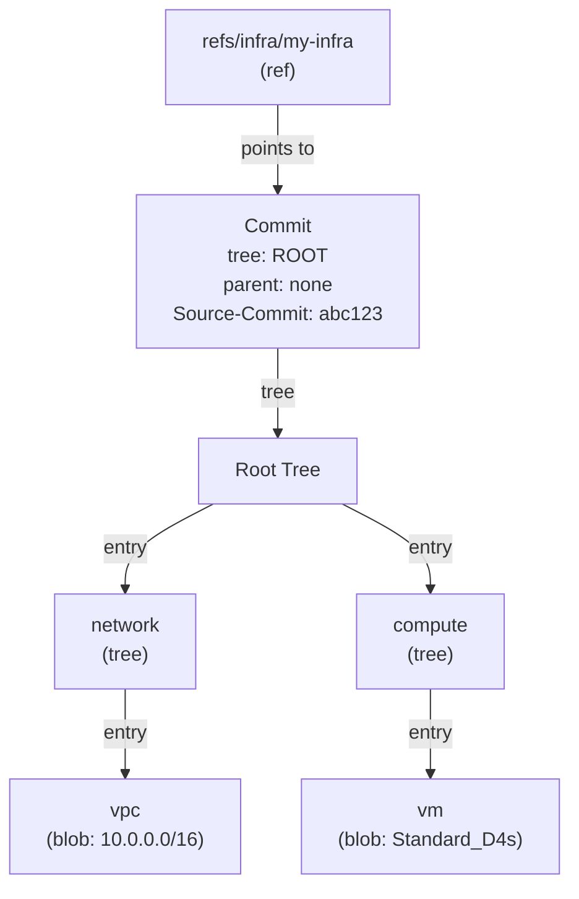
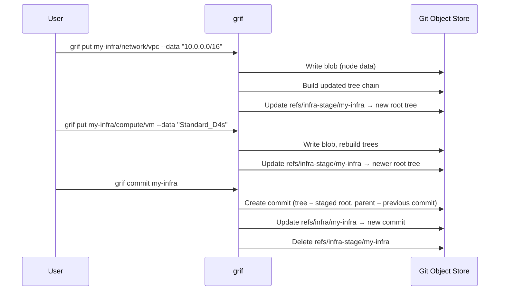
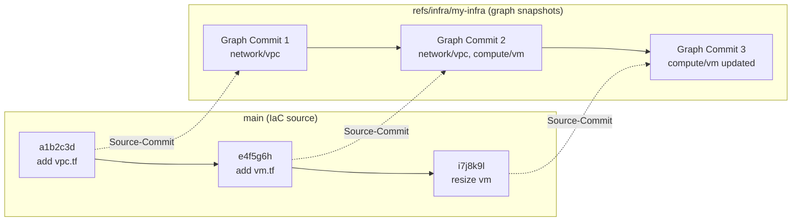

# How grif Uses Git Storage

This document explains how `grif` stores graph data directly inside a Git repository using Git's internal storage primitives. It assumes you are comfortable with everyday Git operations (clone, commit, push, pull) but are not familiar with the underlying storage model.

## Git's Storage Model in Brief

Underneath the commands you use daily, Git stores everything as **objects** in a simple content-addressable database. There are three object types relevant to `grif`:

- **Blob** — a chunk of raw bytes. In normal Git usage a blob holds the contents of a single file. In `grif`, a blob holds the data payload of a single infrastructure node.
- **Tree** — a directory listing. A tree contains named entries, where each entry points to either a blob or another tree. Trees give structure and hierarchy to blobs, just like folders give structure to files.
- **Commit** — a snapshot. A commit points to one tree (the root of the snapshot) and optionally to one or more parent commits, forming a history chain.

Every object is identified by a SHA-1 hash of its content. If two objects have the same content, they share the same hash and are stored only once. This is called **content-addressable storage** and it gives Git automatic deduplication.

One more concept: a **ref** (short for reference) is a named pointer to a commit. A branch like `main` is just a ref — a small file that says "the latest commit on this branch is `abc123`." Refs are how Git (and `grif`) keep track of where history currently stands.

## How grif Maps to Git Objects

`grif` uses these four primitives — blobs, trees, commits, and refs — to implement a versioned graph database. The mapping is:

| Graph concept | Git primitive | Example |
| --- | --- | --- |
| Node data (leaf content) | Blob | A JSON payload describing a VPC |
| Hierarchy (containment) | Tree | `network/` tree containing a `vpc` blob |
| Point-in-time snapshot | Commit | An immutable record of the full graph |
| Graph identity and current version | Ref | `refs/infra/my-infra` |
| Staging area for uncommitted changes | Ref | `refs/infra-stage/my-infra` |

### Diagram: Object Relationships

The following diagram shows how a graph named `my-infra` with two nodes (`network/vpc` and `compute/vm`) is stored as Git objects.



Reading this diagram bottom-up:

1. The **blobs** (`vpc`, `vm`) hold the actual node data.
2. The **trees** (`network`, `compute`) group blobs into a hierarchy — these are the containment edges of the graph.
3. The **root tree** is the top of the hierarchy for this graph version.
4. The **commit** points to the root tree, recording an immutable snapshot.
5. The **ref** (`refs/infra/my-infra`) points to the commit, marking it as the current version of this graph.

## Isolated Ref Namespace

`grif` stores all its refs under `refs/infra/` and `refs/infra-stage/`. These namespaces are completely separate from your normal branches (`refs/heads/`) and tags (`refs/tags/`). This means:

- Graph data never interferes with your branches, tags, or working tree.
- Normal Git workflows (`git checkout`, `git merge`, `git push`) are unaffected.
- Multiple graphs can coexist in the same repository, each with its own ref (e.g., `refs/infra/prod`, `refs/infra/staging`).

## The Stage-Then-Commit Workflow

`grif` follows a two-phase write model, similar to Git's own `git add` / `git commit` pattern:

1. **Stage** — When you run `grif put`, the change is written to a staging tree. A staging ref (`refs/infra-stage/<name>`) tracks the root of this in-progress tree. You can make multiple `put` and `rm` calls to build up a set of changes.
2. **Commit** — When you run `grif commit`, the staged tree is wrapped in a new commit object. The graph ref (`refs/infra/<name>`) advances to point to this new commit, and the staging ref is deleted.



## How a Node Write Works Internally

When you run `grif put my-infra/network/vpc --data "10.0.0.0/16"`, the following happens inside the Git object store:

1. **Resolve the root tree.** If a staging ref exists, use its tree. Otherwise, read the tree from the latest commit on the graph ref.
2. **Walk the path top-down.** For each intermediate segment (`network`), look up the entry in the current tree. If it doesn't exist, create a new empty tree for it.
3. **Write the leaf.** Create a blob containing `10.0.0.0/16` and add it as an entry named `vpc` in the `network` tree.
4. **Rebuild the tree chain bottom-up.** Because a tree entry's hash changed, every ancestor tree needs a new hash too. `grif` walks back up, creating new tree objects at each level. The root tree at the top gets a new hash reflecting the entire updated hierarchy.
5. **Update the staging ref.** Point `refs/infra-stage/my-infra` at the new root tree hash.

This bottom-up rebuild is how Git maintains immutability. Old tree objects still exist and are still valid — they represent the previous state. The new tree objects represent the new state. Nothing is mutated in place.

## Source-Commit Linkage

Every graph commit includes a `Source-Commit` trailer in its commit message:

```text
Initialize graph "my-infra"

Source-Commit: a1b2c3d4e5f6...
```

This records which repository commit (on your normal branches) the graph change corresponds to. It enables co-versioning — you can always trace a graph snapshot back to the exact state of your IaC code.

The following diagram shows two parallel commit histories living in the same repository. The top row is the normal branch (`main`) where IaC source code evolves. The bottom row is the graph ref (`refs/infra/my-infra`) where `grif` records snapshots of the infrastructure graph. Each repo commit links to the graph commit it triggered via the `Source-Commit` trailer.



Reading this diagram:

1. Each commit on `main` represents a change to IaC source files (Terraform, Bicep, etc.).
2. Each graph commit on `refs/infra/my-infra` captures the infrastructure graph at that point.
3. The dashed `Source-Commit` arrows show the linkage — graph commit 2 was produced from repo commit `e4f5g6h`, so you can always correlate a graph snapshot with the exact IaC code that generated it.

Because both histories live in the same Git repository but under separate ref namespaces, they never interfere with each other. You can push, pull, and inspect graph history independently of branch history.

## Versioning and History

Because each graph commit points to its parent, the graph has a full commit history — just like a branch. You can walk this history with `grif log` to see how the infrastructure graph evolved over time. And because Git objects are immutable and content-addressed, every past version of the graph is preserved as long as the commits are reachable.

Git's built-in storage optimizations also apply automatically:

- **Deduplication** — If two nodes have identical content, they share a single blob object.
- **Structural sharing** — If only one node changes, only the affected trees are rewritten. Unchanged subtrees keep their existing objects.
- **Garbage collection** — When a graph is deleted (its ref is removed), the objects it pointed to become unreferenced and are cleaned up by Git's normal garbage collection.

## Sharing Graphs with a Remote

Because graph data is stored as standard Git objects under custom refs, you can push and pull graphs to any Git remote (including GitHub) using normal `git push` and `git fetch` commands.

### Pushing a graph to a remote

```bash
git push origin refs/infra/my-infra:refs/infra/my-infra
```

To push all graphs at once:

```bash
git push origin 'refs/infra/*:refs/infra/*'
```

You can verify the ref arrived on the remote:

```bash
git ls-remote origin | grep infra
```

### Pulling a graph from a remote

A regular `git clone` only fetches `refs/heads/*` and `refs/tags/*`, so graph refs are not included automatically. After cloning, fetch them explicitly:

```bash
git fetch origin refs/infra/my-infra:refs/infra/my-infra
```

To fetch all graphs:

```bash
git fetch origin 'refs/infra/*:refs/infra/*'
```

After fetching, `grif` commands work normally — `grif get`, `grif status`, and `grif commit` all operate on the local refs.

### Automatic fetching

To make `git fetch` and `git pull` automatically include graph refs, add a fetch refspec to your remote config:

```bash
git config --add remote.origin.fetch '+refs/infra/*:refs/infra/*'
```

After this, every `git fetch` brings down graph refs alongside branches and tags.

### Notes

- **Staging refs are local.** Only committed graph refs (`refs/infra/*`) should be pushed. Staging refs (`refs/infra-stage/*`) are local working state and should not be shared.
- **GitHub visibility.** Custom refs do not appear in GitHub's branch or tag dropdowns, but they are accessible via `git ls-remote`, the GitHub Git References API, and `git clone --mirror`.
- **Non-fast-forward pushes.** Git rejects pushes where the remote ref has diverged. Use `--force` only if you are certain you want to overwrite the remote history.
