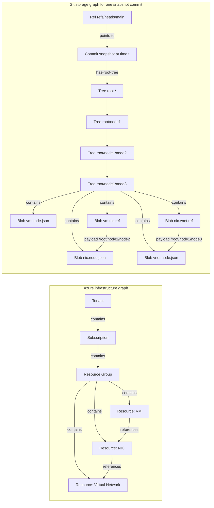

# Git Graph vs Azure Resource Graph: Implementation Comparison

## Goal

Use Git graph concepts to reason about storing **versioned infrastructure** where Azure is modeled as a graph (containment + references).

## Similarities (graph concepts that transfer well)

- **Typed nodes and typed edges**
	- Git: refs, commits, trees, blobs; parent/root-tree/contains edges.
	- Azure: resource/scope nodes; containment/reference edges.
	- In both systems, meaning comes from edge type, not just connectivity.

- **Reachability as the live set**
	- Git treats objects reachable from refs as “in use.”
	- Azure treats resources reachable through subscription/resource-group scopes as managed inventory.
	- This supports snapshotting and garbage-collection-like reasoning.

- **Snapshot-oriented reasoning**
	- A Git commit points to one root tree = one full snapshot.
	- An Azure deployment state can also be viewed as a full graph snapshot at time $t$.

- **Structural sharing potential**
	- Git natively deduplicates identical objects by content hash.
	- Azure state versions usually change sparsely, so most subgraphs can be reused between snapshots.

## Dissimilarities (where mapping is not 1:1)

- **History model**
	- Git history is explicit via commit-parent edges (a DAG).
	- Azure does not expose one canonical global history DAG of resource state; history is assembled from deployments, activity logs, policy events, and control-plane changes.

- **Identity semantics**
	- Git object identity is content-addressed and immutable.
	- Azure resource identity is path/ID-addressed and mutable over time (properties can change while ID remains stable).

- **Containment vs cross-links**
	- Git tree containment is strict and acyclic per snapshot.
	- Azure has a mostly hierarchical containment backbone plus cross-tree references that may create cycles.

- **Operational intent**
	- Git is a storage/version-control substrate.
	- Azure Resource Graph is a query/index surface over current resource metadata, not the canonical persistence layer for full version history.

## Plausible design: store Azure graph versions using Git objects

Model each infrastructure state as a **Git commit snapshot** with canonicalized graph content.

### 1) Canonical node encoding

- Represent each Azure node as canonical JSON blob:
	- Stable key: `resourceId`
	- Type metadata: `resourceType`, `apiVersion`
	- Normalized properties: sorted keys, no volatile fields (timestamps, etags unless needed)
- Hash of canonical JSON becomes the blob identity (Git handles this naturally).

### 2) Tree layout (containment backbone)

Map Azure containment to Git tree paths, for example:

- `/tenants/{tenantId}/subscriptions/{subId}/resourceGroups/{rgName}/providers/{rp}/{type}/{name}.node.json`

This uses tree nesting to encode containment (tenant → subscription → RG → resource).

### 3) Reference edges as traversal blobs in the tree

Because Git trees cannot directly encode arbitrary graph cross-links, store reference edges as small per-node blobs whose entire payload is a traversal path to the target node (like a Git ref), for example:

- Per-node reference file:
	- `{resourcePath}.nic.ref`
	- Example payload (single line):
		- `/root/node1/node2`

If a node has multiple references, store multiple ref blobs (for example, `.nic.ref`, `.vnet.ref`, `.disk.ref`) or a small refs directory under that node.

Containment is path-derived from tree structure; non-hierarchical references are explicit path-based traversal records.

### 4) Commit semantics

- One commit = one infrastructure graph snapshot.
- Commit metadata can carry:
	- collection time
	- source (ARM export / ARG query / deployment event)
	- environment/tenant labels
- Branches represent environments or long-lived tracks:
	- `main` (prod), `dev`, `staging`, `feature/*` for proposed infra changes.

### 5) Diffs and merges

- **Node diff**: changed canonical JSON blobs at same path.
- **Edge diff**: changed `.ref` blob payloads (target path changes).
- **Graph-aware merge** (optional): detect semantic conflicts beyond text conflicts, e.g. two branches changing incompatible target references.

### 6) Querying model

- Materialize a graph view by reading tree paths (containment edges) + `.ref` blobs (reference edges).
- Resolve each `.ref` payload by tree traversal from `/root` to the target node blob.
- Build derived indexes (optional) for faster traversals:
	- reverse edges
	- type-based node sets
	- dependency subgraphs per deployment unit.

## Why this is useful for versioned infrastructure

- Gives a **time-versioned graph** with reproducible snapshots.
- Enables standard Git workflows (review, branch, merge, rollback) on infra graph states.
- Separates stable topology from volatile runtime data via canonicalization.
- Preserves both:
	- hierarchical organization (Git trees)
	- cross-resource dependencies (edge blobs).

## Practical caveats

- Very large estates need sharding/partitioning and selective snapshots.
- Canonicalization rules must be strict; otherwise noisy diffs dominate.
- Some Azure references are implicit or computed at runtime; you may need enrichment steps to make edges explicit.
- Path stability matters: if containment paths move, referenced `toPath` values must be rewritten or redirected.

## Mermaid diagram: Azure graph mapped to Git objects

## One-line conclusion

Treat Azure infrastructure as a typed directed multigraph, then encode each version as a Git commit whose trees capture containment and whose reference blobs encode path-based traversals to target nodes.
